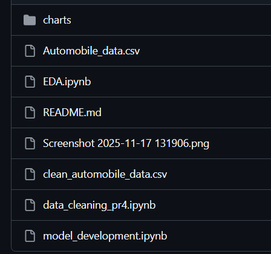
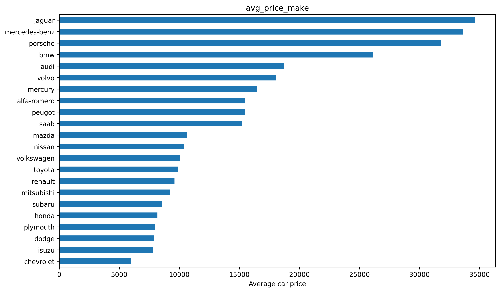
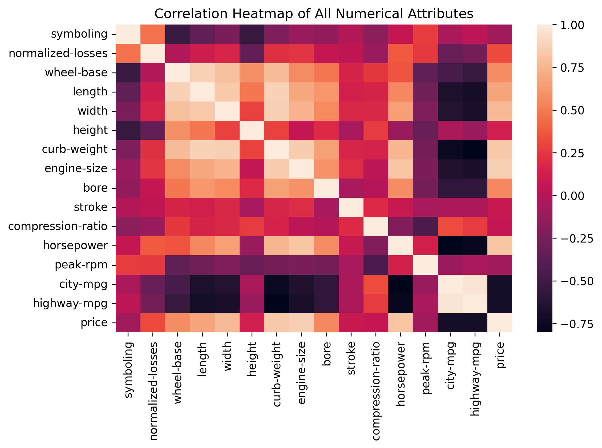
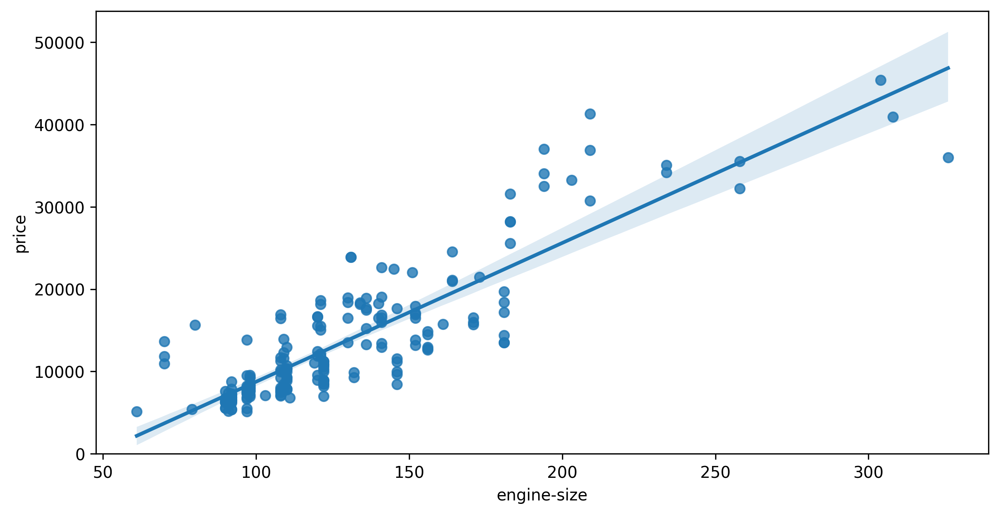
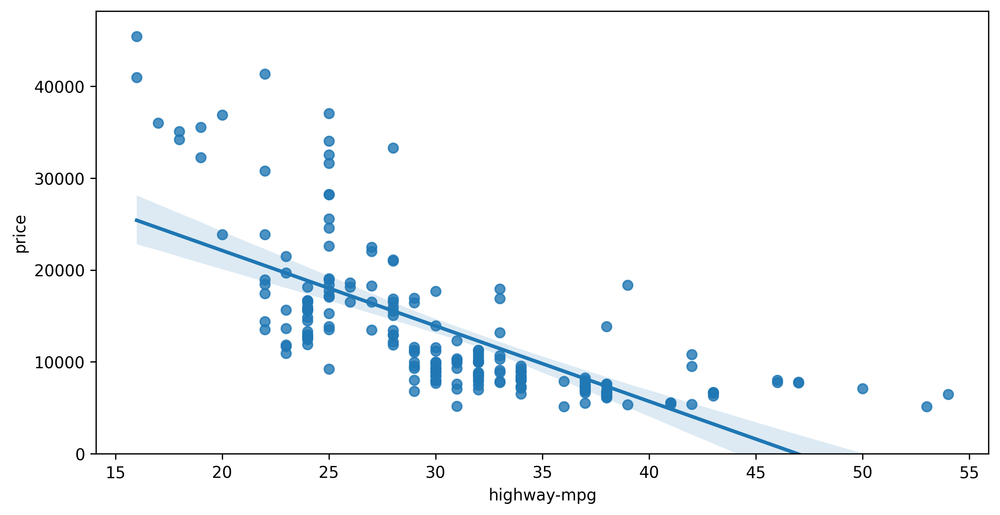
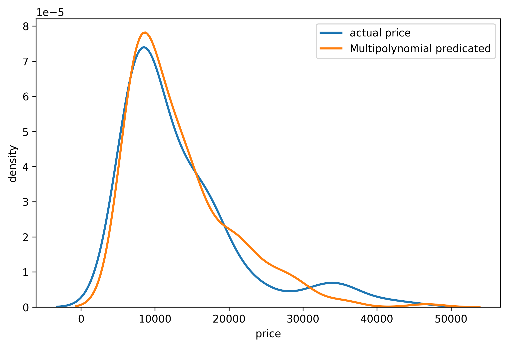

# omshree chinni 

# Automobile Price Analysis & Prediction

## Project Overview
This project focuses on **analyzing and predicting automobile prices** using a real-world dataset containing **26 automobile attributes**.  
The goal is to understand how vehicle specifications such as engine size, horsepower, fuel efficiency, and body style influence the **price of automobiles**.

The project follows a complete **data analytics workflow**:
- Data cleaning & preprocessing
- Exploratory Data Analysis (EDA)
- Feature relationship analysis using visualizations
- Regression-based price prediction modeling

---

## Objectives
- Understand the structure and characteristics of automobile data
- Perform data cleaning and preprocessing
- Explore relationships between features and price using EDA
- Identify key factors affecting automobile prices
- Build regression models to predict automobile prices
- Interpret results for data-driven insights

---

## Project Structure

---

##  Dataset Description
The dataset consists of **26 attributes**, including both categorical and numerical variables.

### Key Feature Categories
- **Categorical Features**:
  - Make, fuel-type, aspiration, body-style, drive-wheels
  - Engine-type, fuel-system

- **Numerical Features**:
  - Engine-size, horsepower, curb-weight
  - City-mpg, highway-mpg, compression-ratio
  - Price (Target Variable)

**Target Variable:** `price`

---

##  Data Cleaning & Preprocessing
Notebook: [Data_cleaning](data_cleaning_pr4.ipynb)

Key steps performed:
- Handling missing and invalid values
- Converting data types to appropriate formats
- Encoding categorical variables
- Feature scaling and normalization
- Exporting a clean dataset for analysis and modeling

Output: [clean_auto_data.csv](clean_automobile_data.csv)

---

##  Exploratory Data Analysis (EDA)
Notebook: [EDA](EDA.ipynb)

EDA was conducted to understand:
- Distribution of automobile prices
- Relationships between numerical features and price
- Impact of categorical features on pricing
- Correlation between variables

###  Price Distribution

**Insight:**  
Automobile prices show a right-skewed distribution, indicating the presence of high-end premium vehicles.

---

###  Correlation heat map

**Insight:**  
- Strong correlation between price and engine-size, horsepower, curb-weight  
- Negative correlation between price and mileage (mpg)  
- Presence of multicollinearity among engine-related features

---

###  Engine Size vs Price

**Insight:**  
A strong positive correlation exists between engine size and price — larger engines generally cost more.

---

### Fuel Efficiency vs Price

**Insight:**  
Fuel-efficient vehicles (higher MPG) are generally priced lower, showing an inverse relationship.

---

## Model Development
Notebook: [model_development](model_development.ipynb)

### Models Used
- Linear Regressiongit status

- Multiple Linear Regression

### Modeling Steps 
- Train-test split
- Model training using cleaned and scaled features
- Performance evaluation using linear and multilinear regression

---

## Model Evaluation Metrics r2 score
- linear_regression = 0.4927007
- multi linear regression  = 0.81643

###  Actual vs Predicted - Multi poly regression

**Key Finding:**  
Engine size, horsepower, mph are the most influential predictors of automobile price.

---

##  Key Insights
- Engine specifications strongly influence price
- Fuel efficiency shows an inverse relationship with price

---

